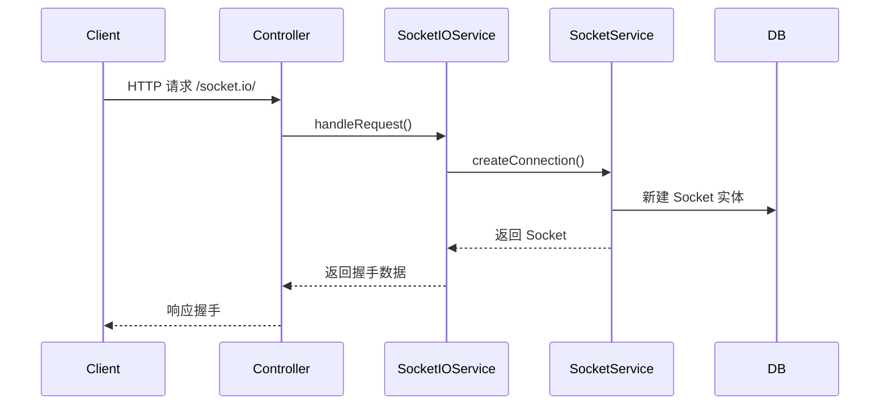
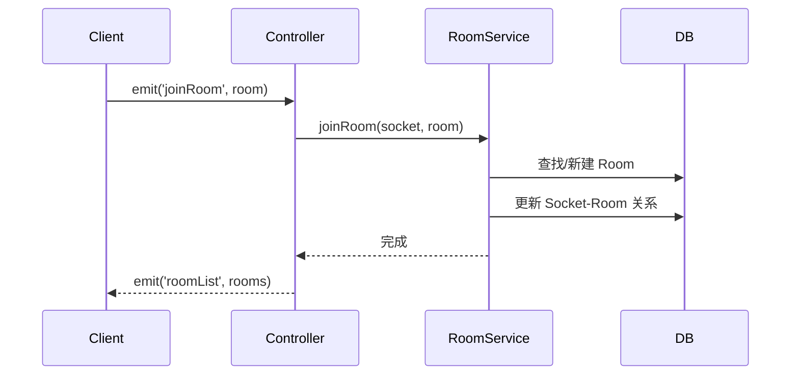
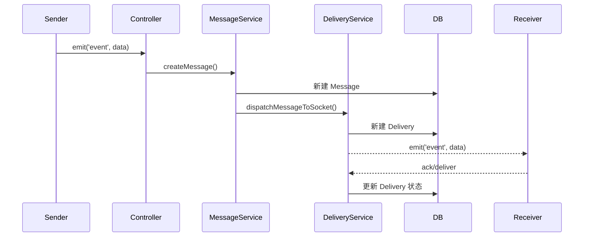

# Socket-IO Bundle 工作流程

本模块主要涉及连接建立、房间管理、消息投递三个核心流程。

---

## 1. 连接建立流程

---

## 2. 房间管理流程

---

## 3. 消息投递流程

---

## 说明

- 所有流程均基于 HTTP/轮询，支持后续扩展 WebSocket。
- 房间和消息均持久化，支持断线重连和消息历史。
- 消息投递有状态跟踪，支持失败重试。
